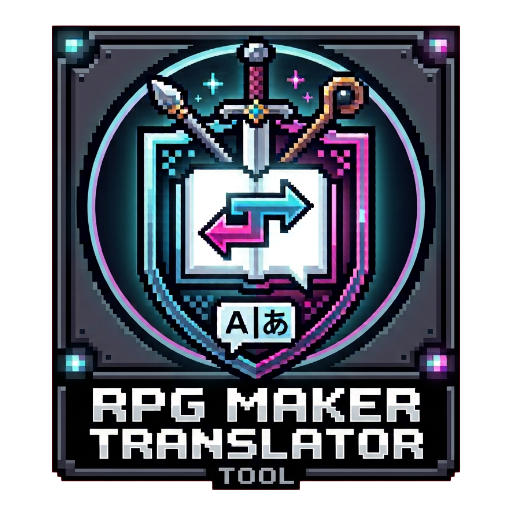
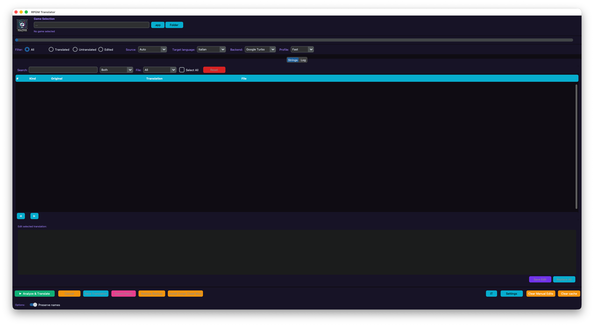

# 🎮 RPGM-Translator




A GUI tool to translate **RPG Maker MV/MZ** games automatically.

Inspired by the logic of **Ren'Py Translator** and the interface style of **WTForge**.



## ✨ Features

- 🕹️ Auto-detects **RPG Maker MV/MZ** games.
- 📝 Extracts translatable strings from:
  - 🗺️ `Map*.json` (dialogues, choices, scrolling text)
  - 🔁 `CommonEvents.json`
  - ⚙️ `System.json` (game title, terms, labels)
  - 🛡️ `Items.json`, `Weapons.json`, `Armors.json`, `Skills.json`, `States.json`, `Enemies.json`, `Actors.json`, `Classes.json`
  - 🔌 `js/plugins.js` (translatable plugin text)
- 🌍 Translation backends: **Google Turbo**, **Bing Ultra**, **OpenRouter**, **Llama local**.
- 🔎 Editable translation table with filters (All / Translated / Untranslated / Edited), file filter, and live search by original text, translation, or both.
- 🔄 **Replace All** — find and replace specific words across all translations or filtered items only.
- 💾 In-place patching with one protected original `data` backup.
- 🗂️ Global and local translation cache, with a one-click cleanup option.
- 📦 Export translated `www/data` as a patch.

## 🆕 Latest

- 🆕 **Edited filter** — show only strings that have been manually edited and saved in `manual_edits.json`.
- 🔄 **Reset translation** — the old **Delete Row** button is now **Reset**: it clears the manual translation for selected rows, removes the entry from `manual_edits.json`, and leaves the original string unchanged.
- 🎯 **Delimiter-based escape code handling** — preserves exact positioning of escape codes (colors, icons) by treating them as delimiters and translating only text segments between them.
- ⚡ **Optimized segment translation** — batch processes all text segments for improved performance.
- 🔧 **Enhanced RPG Maker prefix recognition** — supports multiple consecutive special characters in prefixes (e.g., `<<`, `>>`).
- 👤 **Character name preservation in dialogues** — replaces character names with placeholders before translation and restores them after, preventing unwanted name translations.
- 🔍 **File filter** — filter strings by source file (e.g., Items.json, Armor.json) for easier navigation.
- 🔄 **Replace All** — find and replace specific words across all translations or filtered items only, with case-sensitive option.
- 🐛 **Short text translation fix** — workaround for very short text not being translated by Google due to Unicode special characters.
- **Improved cache reuse** — cache now works across different translation backends and after re-analyzing translated games.
- **Clean GUI display** — script tokens are hidden in the translation table and editor for better readability.
- **String search** — filter the table live by original text, translated text, or both.
- **Restore Backup** — restore the game from the single original `data_bak_original` backup.
- **Safe script dialogue translation** — preserves dialogue prefixes, placeholders, asset identifiers, and plugin command internals while translating visible text.

## 📋 Requirements

- Python 3.9+
- `customtkinter`, `pillow`, `deep-translator`, `requests`

## 🚀 Quick Start

```bash
# macOS / Linux
./start.sh

# Windows
start.bat

# Or directly
python3 rpgm_tool.py
```

## 🔄 Workflow

1. 🎮 **Select Game** — Click `.app` (macOS) or `Folder` and choose the game directory.
2. 🧠 **Analyze & Translate** — Extract and translate all strings automatically.
3. ✏️ **Edit** — Review or edit any string directly in the table.
4. 💾 **Save** — Patch the game files (the original backup is created only once).
5. 📦 **Export** — Optionally export the translated `www/data` as a patch.
6. ♻️ **Start over** — Use **Restore Backup**, then **Clear cache**, before analyzing and translating again.

## 🛡️ Backup

Before the first patch, the tool creates `www/data_bak_original`. This is the only backup kept, and **Restore Backup** always restores from it.

## 🙏 Credits

- Cheat mod powered by **[Forge for RPGM MV/MZ](https://gitgud.io/serjura/forge-mvmz)** by serjura / zero64801.
- The keybind to open the cheat UI is patched to the `1` key for quick access.

## ⚠️ License

Provided "as-is" without warranty. Use at your own risk.
