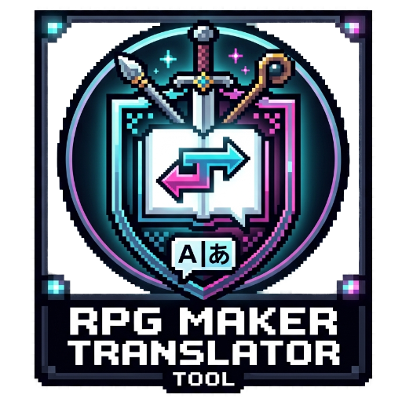
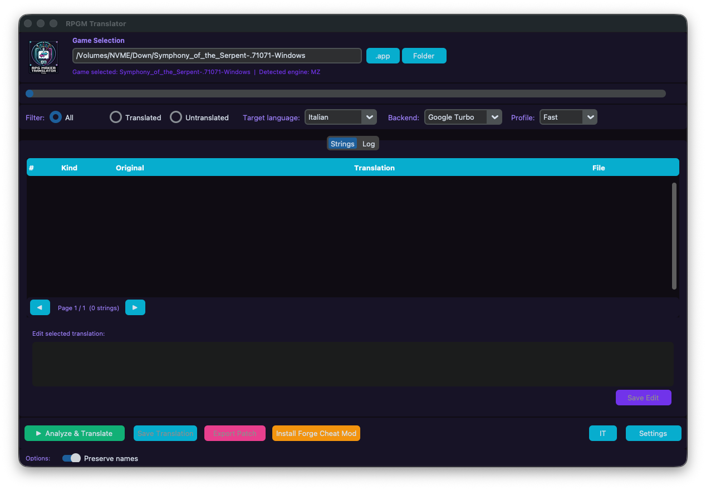

# 🎮 RPGM-Translator






A GUI tool to translate **RPG Maker MV/MZ** games automatically.

It combines the dark tabbed interface of **WTForge** with the translation engine pipeline from **Ren'Py Translator**.

## ✨ Features

- 🕹️ Auto-detects **RPG Maker MV/MZ** games.
- 📝 Extracts translatable strings from:
  - 🗺️ `Map*.json` (dialogues, choices, scrolling text)
  - 🔁 `CommonEvents.json`
  - ⚙️ `System.json` (game title, terms, labels)
  - 🛡️ `Items.json`, `Weapons.json`, `Armors.json`, `Skills.json`, `States.json`, `Enemies.json`, `Actors.json`, `Classes.json`
  - 🔌 `js/plugins.js` (translatable plugin parameters)
- 🌍 Translation backends: **Google Turbo**, **Bing Ultra**, **OpenRouter**, **Llama local**.
- 🔎 Editable translation table with filters (All / Translated / Untranslated).
- 💾 In-place patching with automatic `data` backup.
- 🗂️ Global and local translation cache.
- 📦 Export translated files as a patch.

## 📋 Requirements

- Python 3.9+
- `customtkinter`, `pillow`, `deep-translator`, `requests`

## 🚀 Quick Start

```bash
# macOS / Linux
./start.sh

# Windows
start.bat

# Or directly
python3 rpgm_tool.py
```

## 🔄 Workflow

1. 🎮 **Select Game** — Click `.app` (macOS) or `Folder` and choose the game directory.
2. 🧠 **Analyze & Translate** — Extract and translate all strings automatically.
3. ✏️ **Edit** — Review or edit any string directly in the table.
4. 💾 **Save** — Patch the game files (a backup is created automatically).
5. 📦 **Export** — Optionally export the translated `www/data` as a patch.

## 🛡️ Backup

Before patching, the tool backs up `www/data` to `www/data_bak_<timestamp>`.

## 🙏 Credits

- Cheat mod powered by **[Forge for RPGM MV/MZ](https://gitgud.io/serjura/forge-mvmz)** by serjura / zero64801.
- The keybind to open the cheat UI is patched to the `1` key for quick access.

## ⚠️ License

Provided "as-is" without warranty. Use at your own risk.
